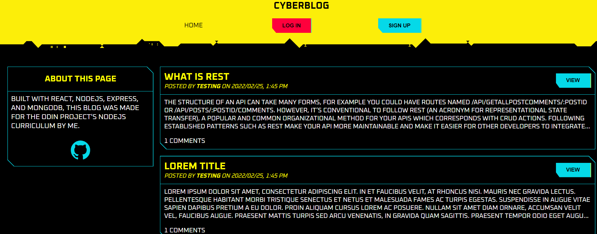
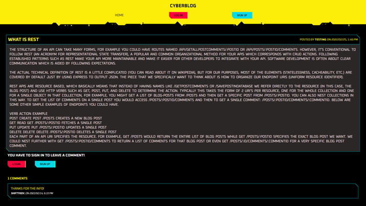

# Cyberblog (Client)

<a href="https://vast-beyond-71925.herokuapp.com/" target="_blank" rel="noopener noreferrer">View the project here!</a> 👀

Blog CMS repo: <em> soon</em> 

<h3>Summary</h3>

This project was made for <a href="https://www.theodinproject.com/paths/full-stack-javascript/courses/nodejs/lessons/blog-api" target="_blank" rel="noopener noreferrer">The Odin Project's</a> NodeJS curriculum. The goal of the project was to build a restful API that can be used to build a blog client and a blog CMS, it was made with the React JS Library, NodeJs, Express, and MongoDb.

User can only leave comments if signed in.

 <h3>Technologies:</h3>
  <ul>
  <li>MongoDB</li>
  <li>Express</li>
  <li>ReactJS</li>
  <li>NodeJS</li>
  <li>PassportJS</li>
 </ul>

 <h3>Notes & Features:</h3>
 <ul>
 
  <li>Passport Authentication using JSON web token </li>
  <li>Bcrypt for password hashing </li>
  <li>MERN stack CRUD application</li>
 </ul>
 
<h3>Screenshots</h3>

<h4>Home screen</h4>

<h4>Post screen</h4>

<h3>Following things yet to be done</h3>
<li>More content/styling</li>
<li>Responsivity</li>
<li>CMS for making blogs</li>